---
---

# 1. GIRIS

## 1.1. Çözülen problem ve önemi ile ilgili bir paragraf açıklama

## 1.2. Problemin cozumu surecinde veri ve analiz hakkinda aciklama

Forbes tarafindan yayinlanan ve gunluk olarak guncellenen veri seti, her
bir milyarderin guncel net degerini, siralamasini, servetinin
bilesenlerini, bazi demografik bilgilerini ve diger finansal bilgileri
icermektedir. Veri setinin ana amaclarindan biri, dünyanın en zengin
milyarderlerinin belgelenmis net degerini yillik olarak siralamaktir.

Bu odev kapsaminda milyarderlerin dagilimlari farkli endustriler,
ulkeler ve bolgelere gore incelenecektir. Milyarderlerin yas, cinsiyet
ve dogum yerlerinin dagılimlari incelenecektir. Milyarderlerin icindeki
kendi kendine milyarder olanlarin (self made) ve servetini miras
alanlarin oranlari karsilastirilacaktir. Milyarderlerin yasadigi
ulkelerin GDP, TÜFE gibi ekonomik gostergeleri incelenecek, bu
gostergeler arasindaki iliskiler analiz edilecektir. "Mekansal analiz"
ile, milyarderlerin dunya genelinde cografi dagilimi grafikler ile
ozetlenecektir.

# 2. GEREKLI PAKETLER

    library(ggplot2) # grafiklerin ciziminde kullanildi
    library(stats)  # t.test, prop.test gibi istatistiksel testlerin ve islemlerin uygulanmasinda kullanildi

# VERININ YUKLENMESI

Verinin cvs dosyasindan yuklenmesi:

    data <- read.csv("C:/Users/Desktop/Billionaires.csv", header = TRUE)
    dim(data)
    ## [1] 2640   35

Veri seti 35 degisken ve 2640 gozlemden olusmaktadir.

Eklenen veri kumesinden rastgele 1000 kisi secimi:

    set.seed(42)
    df <- data[sample(x = nrow(data), size = 1000, replace = FALSE), ]
    dim(df)
    ## [1] 1000   35

Veri setinden yerine koymadan rasgele n = 1000 gozlemlik orneklem
cekilmistir, df olarak adlandirilmistir.

# 3. VERI HAZIRLAMA

## 3.1. Veriyi açıklayınız. Değişken sayısı, gözlem sayısı, değişkenlerin yapısı hakkında bilgiler veriniz.

Toplam eksik gozlem sayisi:

    sum(is.na(df))
    ## [1] 796

Degiskenlerin tipi, eksik gozlem sayisi ve benzersiz gozlem sayilari:

    # class(df$rank) # "integer"
    # class(df["rank"]) # "data.frame"
    # class(df[ ,"rank"]) # "integer"


    # unique(df$rank)
    # unique(df[, "rank"])
    # length(unique(df[, "rank"])) # 146

    for (j in colnames(df)){
      cat(match(j, colnames(df)), j, "-->", class(df[ ,j]), 
          "(","missing =", sum(is.na(df[j])),
          "/", "unique =", length(unique(df[, j])), ")", "\n")
    }
    ## 1 rank --> integer ( missing = 0 / unique = 146 ) 
    ## 2 finalWorth --> integer ( missing = 0 / unique = 146 ) 
    ## 3 category --> character ( missing = 0 / unique = 18 ) 
    ## 4 personName --> character ( missing = 0 / unique = 1000 ) 
    ## 5 age --> integer ( missing = 23 / unique = 75 ) 
    ## 6 country --> character ( missing = 0 / unique = 63 ) 
    ## 7 city --> character ( missing = 0 / unique = 399 ) 
    ## 8 source --> character ( missing = 0 / unique = 464 ) 
    ## 9 industries --> character ( missing = 0 / unique = 18 ) 
    ## 10 countryOfCitizenship --> character ( missing = 0 / unique = 62 ) 
    ## 11 organization --> character ( missing = 0 / unique = 135 ) 
    ## 12 selfMade --> logical ( missing = 0 / unique = 2 ) 
    ## 13 status --> character ( missing = 0 / unique = 6 ) 
    ## 14 gender --> character ( missing = 0 / unique = 2 ) 
    ## 15 birthDate --> character ( missing = 0 / unique = 849 ) 
    ## 16 lastName --> character ( missing = 0 / unique = 763 ) 
    ## 17 firstName --> character ( missing = 0 / unique = 763 ) 
    ## 18 title --> character ( missing = 0 / unique = 57 ) 
    ## 19 date --> character ( missing = 0 / unique = 1 ) 
    ## 20 state --> character ( missing = 0 / unique = 37 ) 
    ## 21 residenceStateRegion --> character ( missing = 0 / unique = 6 ) 
    ## 22 birthYear --> integer ( missing = 28 / unique = 73 ) 
    ## 23 birthMonth --> integer ( missing = 28 / unique = 13 ) 
    ## 24 birthDay --> integer ( missing = 28 / unique = 32 ) 
    ## 25 cpi_country --> numeric ( missing = 71 / unique = 55 ) 
    ## 26 cpi_change_country --> numeric ( missing = 71 / unique = 43 ) 
    ## 27 gdp_country --> character ( missing = 0 / unique = 56 ) 
    ## 28 gross_tertiary_education_enrollment --> numeric ( missing = 71 / unique = 54 ) 
    ## 29 gross_primary_education_enrollment_country --> numeric ( missing = 71 / unique = 52 ) 
    ## 30 life_expectancy_country --> numeric ( missing = 71 / unique = 48 ) 
    ## 31 tax_revenue_country_country --> numeric ( missing = 71 / unique = 49 ) 
    ## 32 total_tax_rate_country --> numeric ( missing = 71 / unique = 54 ) 
    ## 33 population_country --> integer ( missing = 64 / unique = 56 ) 
    ## 34 latitude_country --> numeric ( missing = 64 / unique = 56 ) 
    ## 35 longitude_country --> numeric ( missing = 64 / unique = 56 )

Bu listede "12 selfMade --\> logical ( missing = 0 / unique = 2 )"
satirini acarsak, selfMade degiskeni veri setinin 12. sutunudur, tipi
logical'dır, eksik gozlemi yoktur, degisken 2 farkli deger almaktadir.
Burada unique degerler, degiskenin aldigi farkli degerlerin sayisidir.
Örneğin selfMade degiskeni dogru/yanlis olmak uzere 2 farkli deger
alabilmektedir (unique = 2). Kategorik degiskenler incelenirken,
degiskenin kac farklı kategorisi oldugu bilgisi gerekli olacak.

## 3.2. Veri yukleme ve duzenlemesi konusunda bilgi veriniz.

## 3.3. Verideki tum degiskenleri ozetleyip, yorumlayiniz.

### Degiskenlerin incelenmesi

rank, finalWorth, person name, lastName, firstName --\> c(1, 2, 4, 16,
17)

    df[1:10, c(1, 2, 4, 16, 17)]
    ##      rank finalWorth           personName  lastName  firstName
    ## 2609 2540       1000          Tyler Perry     Perry      Tyler
    ## 2369 2259       1200             Luc Tack      Tack        Luc
    ## 1177 1164       2600       Maria Del Pino  Del Pino      Maria
    ## 1098 1067       2800          Tseng Cheng     Tseng      Cheng
    ## 1252 1217       2500         Bobby Murphy    Murphy      Bobby
    ## 634   624       4400 Qian Dongqi & family      Qian     Dongqi
    ## 2097 2020       1400      Boris Rotenberg Rotenberg      Boris
    ## 1152 1104       2700          Raj Sardana   Sardana        Raj
    ## 1327 1312       2300         Erman Ilicak    Ilicak      Erman
    ## 2072 2020       1400       Liu Ming Chung       Liu Ming Chung

Verideki "personName" degiskeni, lastName ve firstName degiskenlerinin
birlesimi.

country(unique = 63), city(unique = 399), countryOfCitizenship(unique =
62), state(unique = 37), residenceStateRegion(unique = 6) --\> c(6, 7,
10, 20, 21)

    df[1:6, c(6, 7, 20, 21, 10)]
    ##            country    city      state residenceStateRegion countryOfCitizenship
    ## 2609 United States Atlanta    Georgia                South        United States
    ## 2369       Belgium  Deinze                                              Belgium
    ## 1177         Spain  Madrid                                                Spain
    ## 1098        Taiwan                                                       Taiwan
    ## 1252 United States  Venice California                 West        United States
    ## 634          China  Suzhou                                                China

country, city, state, residenceStateRegion degiskenleri milyonerlerin
**ikamet** ettigi yerlesim bolgelerine ait verilerdir.

countryOfCitizenship ise **vatandasi** oldugu ulkedir.

Yukaridaki tabloda city, state, residenceStateRegion degiskenlerinde
eksik gozlemler var. Verinin ilk 21 degiskeni character tipinde
degiskenler. Bu tipdeki degiskenlerin hepsinde eksik gozlem sayisi 0
gorunuyor. Numerik degiskenlerde ise eksik gozlemler var:

    for (j in colnames(df)){
      cat(match(j, colnames(df)), j, "-->", class(df[ ,j]), 
          "(","missing =", sum(is.na(df[j])), ")", "\n")
    }
    ## 1 rank --> integer ( missing = 0 ) 
    ## 2 finalWorth --> integer ( missing = 0 ) 
    ## 3 category --> character ( missing = 0 ) 
    ## 4 personName --> character ( missing = 0 ) 
    ## 5 age --> integer ( missing = 23 ) 
    ## 6 country --> character ( missing = 0 ) 
    ## 7 city --> character ( missing = 0 ) 
    ## 8 source --> character ( missing = 0 ) 
    ## 9 industries --> character ( missing = 0 ) 
    ## 10 countryOfCitizenship --> character ( missing = 0 ) 
    ## 11 organization --> character ( missing = 0 ) 
    ## 12 selfMade --> logical ( missing = 0 ) 
    ## 13 status --> character ( missing = 0 ) 
    ## 14 gender --> character ( missing = 0 ) 
    ## 15 birthDate --> character ( missing = 0 ) 
    ## 16 lastName --> character ( missing = 0 ) 
    ## 17 firstName --> character ( missing = 0 ) 
    ## 18 title --> character ( missing = 0 ) 
    ## 19 date --> character ( missing = 0 ) 
    ## 20 state --> character ( missing = 0 ) 
    ## 21 residenceStateRegion --> character ( missing = 0 ) 
    ## 22 birthYear --> integer ( missing = 28 ) 
    ## 23 birthMonth --> integer ( missing = 28 ) 
    ## 24 birthDay --> integer ( missing = 28 ) 
    ## 25 cpi_country --> numeric ( missing = 71 ) 
    ## 26 cpi_change_country --> numeric ( missing = 71 ) 
    ## 27 gdp_country --> character ( missing = 0 ) 
    ## 28 gross_tertiary_education_enrollment --> numeric ( missing = 71 ) 
    ## 29 gross_primary_education_enrollment_country --> numeric ( missing = 71 ) 
    ## 30 life_expectancy_country --> numeric ( missing = 71 ) 
    ## 31 tax_revenue_country_country --> numeric ( missing = 71 ) 
    ## 32 total_tax_rate_country --> numeric ( missing = 71 ) 
    ## 33 population_country --> integer ( missing = 64 ) 
    ## 34 latitude_country --> numeric ( missing = 64 ) 
    ## 35 longitude_country --> numeric ( missing = 64 )

Bu degiskenlerdeki eksik gozlemler tekrar incelenmeli.

state degiskenin eksik gozlemlerinin incelenmesi:

    table(df$state, useNA = "always")
    ## 
    ##                                 Arizona          California            Colorado 
    ##                 699                   2                  74                   4 
    ##         Connecticut             Florida             Georgia               Idaho 
    ##                   7                  41                  11                   1 
    ##            Illinois             Indiana                Iowa              Kansas 
    ##                  10                   1                   1                   2 
    ##           Louisiana            Maryland       Massachusetts         Mississippi 
    ##                   1                   3                   8                   1 
    ##            Missouri             Montana            Nebraska              Nevada 
    ##                   3                   3                   2                   8 
    ##       New Hampshire          New Jersey            New York      North Carolina 
    ##                   1                   1                  54                   1 
    ##                Ohio            Oklahoma              Oregon        Pennsylvania 
    ##                   1                   1                   3                   9 
    ##      South Carolina           Tennessee               Texas U.S. Virgin Islands 
    ##                   1                   4                  25                   1 
    ##                Utah            Virginia          Washington           Wisconsin 
    ##                   2                   3                   5                   5 
    ##             Wyoming                <NA> 
    ##                   1                   0

state sutununda 699 gozlem bos. R bu eksik gozlemleri kategorik
degiskenin bir sinifi olarak algiliyor. Eksik gozlemlere NA atanmali.

table() fonksiyonunda eksik veriler için belirtilebilecek 3 arguman
vardir: "always", "ifany", "no"

sirasiyla: eksik gozlem sayisini her zaman yaz (eksik gozlem olmadiginda
0 yazar), eksik gozlem varsa yaz, eksik gozlem sayisini asla yazma

Eksik gozlemlere NA atanmasi:

eger/ifelse (state degiskenin degeri bos (df\$state == \"\") ise, yerine
NA ata, degilse kendi degerini (df\$state) ata)

    df$state <- ifelse(df$state == "", NA, df$state)
    sum(is.na(df$state))
    ## [1] 699

Ilk 21 sutunun buyuk cogunlugu "chr" tipinde. 1 rank, 2 finalWorth, 5
age ve 12 selfMade sutunlari haric hepsi character tipi sutun.

5.  sutun olan "age" degiskeni integer. Bu degiskendeki eksik gozlemler
    dogru formatta. bos olan gozlem yok:

```{=html}
<!-- -->
```
    table(df$age, useNA = "always")
    ## 
    ##   21   27   28   29   30   31   33   34   35   36   37   38   39   40   41   42 
    ##    1    1    1    1    2    1    1    2    3    4    4    4    4    5   10    3 
    ##   43   44   45   46   47   48   49   50   51   52   53   54   55   56   57   58 
    ##    8    3    8   12    6    9   17   12   12   26   29   21   25   22   36   24 
    ##   59   60   61   62   63   64   65   66   67   68   69   70   71   72   73   74 
    ##   29   32   40   23   22   22   28   34   36   18   24   25   21   24   30   20 
    ##   75   76   77   78   79   80   81   82   83   84   85   86   87   88   89   90 
    ##   19   22   24   20   15   15   16   10   12    6   13    7   13    6    3    5 
    ##   91   92   93   94   95   96   97   98   99  101 <NA> 
    ##    4    5    2    4    3    1    3    2    1    1   23

Veride 12. sutun olan "selfMade" degiskeni ise logical. Bu degiskenin de
ayri olarak incelenmesine karar verildi. Bu degiskende de bos gozlem
yok:

    table(df$selfMade, useNA = "always")
    ## 
    ## FALSE  TRUE  <NA> 
    ##   273   727     0

Verinin ilk 21 sutunu icinde, 1, 2, 5 ve 12. sutunlar haric, tum
sutunlar character tipinde.

apply() fonksiyonu yardimi ile character tipindeki sutunlarin eksik
gozlemlerine NA atanmasi:

    my.NA <- function(x) {ifelse(x == "", NA, x)}

    df[, c(3, 4, 6:11, 13:21)] <- apply(df[, c(3, 4, 6:11, 13:21)], 2, my.NA)

apply() fonksiyonu bir dizi, matris veya dataframe üzerinde bir işlemi
tekrarli olarak yapar. Ornegin bir dataframe'in tum sutunları icin
tekrarlı olarak summary() komutunu uygular. Dataframe'de 5 sutun varsa 5
tane cikti olacaktir. MARGIN islemin satira, sutuna ya da ikisine birden
yapilacagini belirler.

Fonksiyonun yapisi asagidaki gibidir, kaynak:
<https://r-coder.com/apply-r/>

apply fonksiyonu: apply(X = data, MARGIN = 2, FUN = Function to be
applied)

MARGIN argument, which is usually set to 1, 2 or c(1, 2)

apply(X = df, MARGIN = 1, FUN = summary) \# Summary for each row

apply(X = df, MARGIN = 2, FUN = summary) \# Summary for each column

Verinin eksik gözlemleri:

    for (j in colnames(df)){
      cat(match(j, colnames(df)), j, "-->", class(df[ ,j]), 
          "(","missing =", sum(is.na(df[j])), ")", "\n")
    }
    ## 1 rank --> integer ( missing = 0 ) 
    ## 2 finalWorth --> integer ( missing = 0 ) 
    ## 3 category --> character ( missing = 0 ) 
    ## 4 personName --> character ( missing = 0 ) 
    ## 5 age --> integer ( missing = 23 ) 
    ## 6 country --> character ( missing = 13 ) 
    ## 7 city --> character ( missing = 28 ) 
    ## 8 source --> character ( missing = 0 ) 
    ## 9 industries --> character ( missing = 0 ) 
    ## 10 countryOfCitizenship --> character ( missing = 0 ) 
    ## 11 organization --> character ( missing = 860 ) 
    ## 12 selfMade --> logical ( missing = 0 ) 
    ## 13 status --> character ( missing = 0 ) 
    ## 14 gender --> character ( missing = 0 ) 
    ## 15 birthDate --> character ( missing = 28 ) 
    ## 16 lastName --> character ( missing = 0 ) 
    ## 17 firstName --> character ( missing = 1 ) 
    ## 18 title --> character ( missing = 855 ) 
    ## 19 date --> character ( missing = 0 ) 
    ## 20 state --> character ( missing = 699 ) 
    ## 21 residenceStateRegion --> character ( missing = 702 ) 
    ## 22 birthYear --> integer ( missing = 28 ) 
    ## 23 birthMonth --> integer ( missing = 28 ) 
    ## 24 birthDay --> integer ( missing = 28 ) 
    ## 25 cpi_country --> numeric ( missing = 71 ) 
    ## 26 cpi_change_country --> numeric ( missing = 71 ) 
    ## 27 gdp_country --> character ( missing = 0 ) 
    ## 28 gross_tertiary_education_enrollment --> numeric ( missing = 71 ) 
    ## 29 gross_primary_education_enrollment_country --> numeric ( missing = 71 ) 
    ## 30 life_expectancy_country --> numeric ( missing = 71 ) 
    ## 31 tax_revenue_country_country --> numeric ( missing = 71 ) 
    ## 32 total_tax_rate_country --> numeric ( missing = 71 ) 
    ## 33 population_country --> integer ( missing = 64 ) 
    ## 34 latitude_country --> numeric ( missing = 64 ) 
    ## 35 longitude_country --> numeric ( missing = 64 )

**Degiskenlerin incelenmesinin devami**

age, birthDate, birthYear, birthMonth, birthDay --\> c(5, 15, 22, 23,
24)

    df[1:10, c(5, 15, 22, 23, 24)]
    ##      age        birthDate birthYear birthMonth birthDay
    ## 2609  53   9/14/1969 0:00      1969          9       14
    ## 2369  61  9.01.1961 00:00      1961          9        1
    ## 1177  67   3/19/1956 0:00      1956          3       19
    ## 1098  61 12.01.1961 00:00      1961         12        1
    ## 1252  34   7/19/1988 0:00      1988          7       19
    ## 634   65  1.01.1958 00:00      1958          1        1
    ## 2097  66  1.03.1957 00:00      1957          1        3
    ## 1152  63  3.08.1960 00:00      1960          3        8
    ## 1327  55 10.03.1967 00:00      1967         10        3
    ## 2072  60  1.01.1963 00:00      1963          1        1

birthDate degiskeni birthYear, birthMonth, birthDay' in birlesimi.

Verideki "date" isimli degisken "veri toplama tarihi"dir. Yapisi:

19 date --\> character ( missing = 0 / unique = 1 )

date degiskeninin benzersiz gozlem sayisi 1' dir. Yani odev icin cekilen
orneklemin tum gozlemlerinin toplanma tarihi aynidir:

    df[1:10, c(19, 5, 15)]
    ##                 date age        birthDate
    ## 2609 4.04.2023 05:01  53   9/14/1969 0:00
    ## 2369 4.04.2023 05:01  61  9.01.1961 00:00
    ## 1177 4.04.2023 05:01  67   3/19/1956 0:00
    ## 1098 4.04.2023 05:01  61 12.01.1961 00:00
    ## 1252 4.04.2023 05:01  34   7/19/1988 0:00
    ## 634  4.04.2023 05:01  65  1.01.1958 00:00
    ## 2097 4.04.2023 05:01  66  1.03.1957 00:00
    ## 1152 4.04.2023 05:01  63  3.08.1960 00:00
    ## 1327 4.04.2023 05:01  55 10.03.1967 00:00
    ## 2072 4.04.2023 05:01  60  1.01.1963 00:00

n = 2640 gozlemden olusan ilk veride date kac fakli deger alıyor:

    length(unique(data$date))
    ## [1] 2
    unique(data$date)
    ## [1] "4.04.2023 05:01" "4.04.2023 09:01"

category(unique = 18), source(unique = 464), industries(unique = 18)
--\> c(3, 8, 9)

    df[1:10, c(3, 8, 9)]
    ##                        category                         source
    ## 2609      Media & Entertainment             Movies, television
    ## 2369              Manufacturing             Textile, chemicals
    ## 1177 Construction & Engineering                   Construction
    ## 1098              Manufacturing                 Petrochemicals 
    ## 1252                 Technology                       Snapchat
    ## 634               Manufacturing           Home-cleaning robots
    ## 2097 Construction & Engineering Construction, pipes, chemicals
    ## 1152                 Technology            Technology services
    ## 1327 Construction & Engineering                   Construction
    ## 2072              Manufacturing                          Paper
    ##                      industries
    ## 2609      Media & Entertainment
    ## 2369              Manufacturing
    ## 1177 Construction & Engineering
    ## 1098              Manufacturing
    ## 1252                 Technology
    ## 634               Manufacturing
    ## 2097 Construction & Engineering
    ## 1152                 Technology
    ## 1327 Construction & Engineering
    ## 2072              Manufacturing

Iki degisken ayni veriyi iceriyor olabilir:

    df[1:20, c(3, 9)]
    ##                        category                 industries
    ## 2609      Media & Entertainment      Media & Entertainment
    ## 2369              Manufacturing              Manufacturing
    ## 1177 Construction & Engineering Construction & Engineering
    ## 1098              Manufacturing              Manufacturing
    ## 1252                 Technology                 Technology
    ## 634               Manufacturing              Manufacturing
    ## 2097 Construction & Engineering Construction & Engineering
    ## 1152                 Technology                 Technology
    ## 1327 Construction & Engineering Construction & Engineering
    ## 2072              Manufacturing              Manufacturing
    ## 356                      Energy                     Energy
    ## 1625      Finance & Investments      Finance & Investments
    ## 165                      Sports                     Sports
    ## 2458                 Automotive                 Automotive
    ## 1903            Food & Beverage            Food & Beverage
    ## 899       Finance & Investments      Finance & Investments
    ## 601                     Telecom                    Telecom
    ## 1307      Finance & Investments      Finance & Investments
    ## 932  Construction & Engineering Construction & Engineering
    ## 997       Finance & Investments      Finance & Investments

identical {base}: iki nesnenin (vektor, matris, liste, vb.) birebir ayni
olup olmadigini kontrol etmek icin kullanilir:

    identical(df$category, df$industries) 
    ## [1] TRUE

Output = TRUE yani iki degisken birebir ayni verileri iceriyor.

<https://statorials.org/tr/rdeki-iki-vektoru-karsilastirin/>

organization(unique = 135), selfMade(unique = 2), status(unique = 6),
title(unique = 57) --\> c(11, 12, 13, 18)

    df[1:10, c(11, 12, 13, 18)]
    ##      organization selfMade status     title
    ## 2609   Television     TRUE      E  Director
    ## 2369         <NA>     TRUE      E      <NA>
    ## 1177         <NA>    FALSE      U      <NA>
    ## 1098         <NA>    FALSE      U      <NA>
    ## 1252         Snap     TRUE      D Cofounder
    ## 634          <NA>     TRUE      D      <NA>
    ## 2097         <NA>     TRUE      U      <NA>
    ## 1152         <NA>     TRUE      N      <NA>
    ## 1327         <NA>     TRUE      E      <NA>
    ## 2072         <NA>     TRUE      D      <NA>

Sayisal degiskenler: c(25:35)

    df[1:10, c(25:30)]
    ##      cpi_country cpi_change_country          gdp_country
    ## 2609      117.24                7.5 $21,427,700,000,000 
    ## 2369      117.11                1.4    $529,606,710,418 
    ## 1177      110.96                0.7  $1,394,116,310,769 
    ## 1098          NA                 NA                     
    ## 1252      117.24                7.5 $21,427,700,000,000 
    ## 634       125.08                2.9 $19,910,000,000,000 
    ## 2097      180.75                4.5  $1,699,876,578,871 
    ## 1152      117.24                7.5 $21,427,700,000,000 
    ## 1327      234.44               15.2    $754,411,708,203 
    ## 2072          NA                 NA                     
    ##      gross_tertiary_education_enrollment
    ## 2609                                88.2
    ## 2369                                79.7
    ## 1177                                88.9
    ## 1098                                  NA
    ## 1252                                88.2
    ## 634                                 50.6
    ## 2097                                81.9
    ## 1152                                88.2
    ## 1327                                23.9
    ## 2072                                  NA
    ##      gross_primary_education_enrollment_country life_expectancy_country
    ## 2609                                      101.8                    78.5
    ## 2369                                      103.9                    81.6
    ## 1177                                      102.7                    83.3
    ## 1098                                         NA                      NA
    ## 1252                                      101.8                    78.5
    ## 634                                       100.2                    77.0
    ## 2097                                      102.6                    72.7
    ## 1152                                      101.8                    78.5
    ## 1327                                       93.2                    77.4
    ## 2072                                         NA                      NA

gdp_country degiskeni hatali olarak "chr" tipinde atanmis. Sayi
formatinda da degil, dolar isareti var. Kullanilabilmesi için once dolar
isaretinin kaldirilmasi ve duzenlenmesi lazim.

    df[1:10, c(30:35)]
    ##      life_expectancy_country tax_revenue_country_country total_tax_rate_country
    ## 2609                    78.5                         9.6                   36.6
    ## 2369                    81.6                        24.0                   55.4
    ## 1177                    83.3                        14.2                   47.0
    ## 1098                      NA                          NA                     NA
    ## 1252                    78.5                         9.6                   36.6
    ## 634                     77.0                         9.4                   59.2
    ## 2097                    72.7                        11.4                   46.2
    ## 1152                    78.5                         9.6                   36.6
    ## 1327                    77.4                        17.9                   42.3
    ## 2072                      NA                          NA                     NA
    ##      population_country latitude_country longitude_country
    ## 2609          328239523         37.09024        -95.712891
    ## 2369           11484055         50.50389          4.469936
    ## 1177           47076781         40.46367         -3.749220
    ## 1098                 NA               NA                NA
    ## 1252          328239523         37.09024        -95.712891
    ## 634          1397715000         35.86166        104.195397
    ## 2097          144373535         61.52401        105.318756
    ## 1152          328239523         37.09024        -95.712891
    ## 1327           83429615         38.96375         35.243322
    ## 2072                 NA               NA                NA

### Odevde kullanilacak degiskenler: {#odevde-kullanilacak-degiskenler-1}

finalWorth, age, country(unique = 63), industries(unique = 18),
selfMade(unique = 2):

    df[1:10, c(2, 5, 6, 9, 12)]
    ##      finalWorth age       country                 industries selfMade
    ## 2609       1000  53 United States      Media & Entertainment     TRUE
    ## 2369       1200  61       Belgium              Manufacturing     TRUE
    ## 1177       2600  67         Spain Construction & Engineering    FALSE
    ## 1098       2800  61        Taiwan              Manufacturing    FALSE
    ## 1252       2500  34 United States                 Technology     TRUE
    ## 634        4400  65         China              Manufacturing     TRUE
    ## 2097       1400  66        Russia Construction & Engineering     TRUE
    ## 1152       2700  63 United States                 Technology     TRUE
    ## 1327       2300  55        Turkey Construction & Engineering     TRUE
    ## 2072       1400  60     Hong Kong              Manufacturing     TRUE

**finalWorth**: Milyarderin Amerikan dolari cinsinden nihai net degeri.

**country**: Milyarderin ikamet ettigi ulke.

**industries**: Milyarderin is alanlariyla iliskilendirilen endustriler.

**selfMade**: Milyarderin servetini kendi cabasi ile kazanip
kazanmadigini belirten (True/False).

status(unique = 6), gender(unique = 2), cpi_country, cpi_change_country,
gdp_country:

    df[1:10, c(13, 14, 25, 26, 27)]
    ##      status gender cpi_country cpi_change_country          gdp_country
    ## 2609      E      M      117.24                7.5 $21,427,700,000,000 
    ## 2369      E      M      117.11                1.4    $529,606,710,418 
    ## 1177      U      F      110.96                0.7  $1,394,116,310,769 
    ## 1098      U      M          NA                 NA                     
    ## 1252      D      M      117.24                7.5 $21,427,700,000,000 
    ## 634       D      M      125.08                2.9 $19,910,000,000,000 
    ## 2097      U      M      180.75                4.5  $1,699,876,578,871 
    ## 1152      N      M      117.24                7.5 $21,427,700,000,000 
    ## 1327      E      M      234.44               15.2    $754,411,708,203 
    ## 2072      D      M          NA                 NA

**status**: "D" kendi cabasiyla kazanilmis serveti temsil eder
(Kurucular/Girisimciler), "U" ise miras veya kazanilmamis serveti
gosterir.

**cpi_country**: Milyarderin ulkesinin Tuketici Fiyat Endeksi (TUFE).

**cpi_change_country**: Milyarderin ulkesindeki TUFE degisimi.

**gdp_country**: Milyarderin ulkesinin Gayri Safi Yurtici Hasilasi
(GSYIH).

# 4. ANALIZ

## 4.1. Servet dagilim analizi: Milyarderlerin servetinin farkli sektorlere(industries), ulkelere(country) ve bolgelere(residenceStateRegion) dagilimini kesfedin.

Analiz edilecek degiskenlerin frekans tabloları apply() fonksiyonu
yardimi ile 2 adimda olusturulmustur. Ilk adımda verilen bir kategorik
degiskenin frekans tablosunu hazirlayan my.table() isimli bir fonksiyon
olusturulmustur. Ikınci adimda apply() ile df' in belirtilen sutunlarına
(MARGIN = 2) bu fonksiyon tekrarlı bir sekilde uygulanmistir:

    my.table <- function(x) {
      n <- table(x, useNA = "ifany")
      percent <- prop.table(n)*100
      f_table <- cbind(n, percent)
    }

    # apply(df[c("industries", "country", "countryOfCitizenship","residenceStateRegion")], 2, my.table)
    # country(unique = 63) ve countryOfCitizenship(unique = 62) cok fazla sayida kategoriye sahip oldugundan frekans tablolarindan cikarilmistir.

    apply(df[c("industries", "residenceStateRegion")], 2, my.table)
    ## $industries
    ##                              n percent
    ## Automotive                  24     2.4
    ## Construction & Engineering  11     1.1
    ## Diversified                 68     6.8
    ## Energy                      36     3.6
    ## Fashion & Retail           101    10.1
    ## Finance & Investments      149    14.9
    ## Food & Beverage             70     7.0
    ## Gambling & Casinos           9     0.9
    ## Healthcare                  79     7.9
    ## Logistics                   12     1.2
    ## Manufacturing              118    11.8
    ## Media & Entertainment       31     3.1
    ## Metals & Mining             22     2.2
    ## Real Estate                 82     8.2
    ## Service                     22     2.2
    ## Sports                      17     1.7
    ## Technology                 135    13.5
    ## Telecom                     14     1.4
    ## 
    ## $residenceStateRegion
    ##                    n percent
    ## Midwest           24     2.4
    ## Northeast         80     8.0
    ## South             92     9.2
    ## U.S. Territories   1     0.1
    ## West             101    10.1
    ## <NA>             702    70.2

### Milyonerlerin endustrilere gore dagilimi (industries, unique = 18):

    ggplot(df, aes(x = industries)) +
      geom_bar(fill = "blue", width = 0.7) +
      coord_flip() +  # Koordinatları çevirerek bar'ları yatay yapma (R CookBook 10.17)
      labs(title = "Distribution of Millionaires by Industries", x = "Industries")

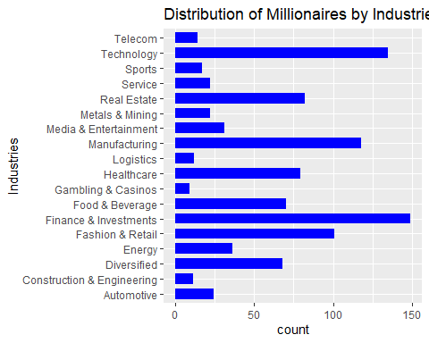{width="5.0526312335958in"
height="4.0421052055993in"}

Bar grafigindeki bar'lar, milyonerlerin sayisini degilde
oranlarini(percent) verirse daha okunur bir grafik olacaktir. Grafigin
cizilebilmesi icin once degiskenin frekans tablosu olusturulmustur:

    df_industries <- as.data.frame(my.table(df$industries)) # industries' in frekans tablosunu dataframe olarak kaydet

    df_industries
    ##                              n percent
    ## Automotive                  24     2.4
    ## Construction & Engineering  11     1.1
    ## Diversified                 68     6.8
    ## Energy                      36     3.6
    ## Fashion & Retail           101    10.1
    ## Finance & Investments      149    14.9
    ## Food & Beverage             70     7.0
    ## Gambling & Casinos           9     0.9
    ## Healthcare                  79     7.9
    ## Logistics                   12     1.2
    ## Manufacturing              118    11.8
    ## Media & Entertainment       31     3.1
    ## Metals & Mining             22     2.2
    ## Real Estate                 82     8.2
    ## Service                     22     2.2
    ## Sports                      17     1.7
    ## Technology                 135    13.5
    ## Telecom                     14     1.4
    df_industries$industries <- rownames(df_industries) # satir isimlerini, industries sutunu olarak dataframe'e ekle

    df_industries
    ##                              n percent                 industries
    ## Automotive                  24     2.4                 Automotive
    ## Construction & Engineering  11     1.1 Construction & Engineering
    ## Diversified                 68     6.8                Diversified
    ## Energy                      36     3.6                     Energy
    ## Fashion & Retail           101    10.1           Fashion & Retail
    ## Finance & Investments      149    14.9      Finance & Investments
    ## Food & Beverage             70     7.0            Food & Beverage
    ## Gambling & Casinos           9     0.9         Gambling & Casinos
    ## Healthcare                  79     7.9                 Healthcare
    ## Logistics                   12     1.2                  Logistics
    ## Manufacturing              118    11.8              Manufacturing
    ## Media & Entertainment       31     3.1      Media & Entertainment
    ## Metals & Mining             22     2.2            Metals & Mining
    ## Real Estate                 82     8.2                Real Estate
    ## Service                     22     2.2                    Service
    ## Sports                      17     1.7                     Sports
    ## Technology                 135    13.5                 Technology
    ## Telecom                     14     1.4                    Telecom

stat = "identity" argumani ile barlarin yuksekliginin
"df_industries\$percent" degiskeninden alinacagi bildirilir. (R CookBook
10.10)

scale_y\_continuous() fonksiyonu, y ekseninin (percent) daha sik
isaretlenmesini sagladi (Cookbook for R-\>Graphs-\>Axes,
<http://www.cookbook-r.com/Graphs/Axes_(ggplot2)/>)

    ggplot(df_industries, aes(x = industries, y = percent)) +
      geom_bar(stat = "identity", fill = "blue", width = 0.7) +
      coord_flip() +
      labs(title = "Distribution of Millionaires by Industries", x = "Industries", y = "Percent(%)") +
      scale_y_continuous(breaks = seq(0, max(df_industries$percent), by = 1)) 

{width="5.0526312335958in"
height="4.0421052055993in"}

### Milyonerlerin ikamet ettigi ulkeye gore dagilimi (country, unique = 63)

Milyonerlerin ikamet ettigi ulkelerin frekans tablosu:

    df_country <- as.data.frame(my.table(df$country))
    df_country$country <- rownames(df_country)
    df_country <- df_country[df_country$country != "NA.", , drop = FALSE] # eksik degerler satirini siler
    df_country
    ##                        n percent              country
    ## Algeria                1     0.1              Algeria
    ## Argentina              2     0.2            Argentina
    ## Australia             14     1.4            Australia
    ## Austria                3     0.3              Austria
    ## Bahamas                2     0.2              Bahamas
    ## Belgium                2     0.2              Belgium
    ## Bermuda                1     0.1              Bermuda
    ## Brazil                13     1.3               Brazil
    ## Canada                15     1.5               Canada
    ## Cayman.Islands         1     0.1       Cayman.Islands
    ## Chile                  3     0.3                Chile
    ## China                215    21.5                China
    ## Colombia               1     0.1             Colombia
    ## Cyprus                 1     0.1               Cyprus
    ## Czech.Republic         2     0.2       Czech.Republic
    ## Denmark                1     0.1              Denmark
    ## Egypt                  1     0.1                Egypt
    ## Eswatini..Swaziland.   1     0.1 Eswatini..Swaziland.
    ## Finland                1     0.1              Finland
    ## France                10     1.0               France
    ## Germany               38     3.8              Germany
    ## Greece                 1     0.1               Greece
    ## Hong.Kong             27     2.7            Hong.Kong
    ## Hungary                2     0.2              Hungary
    ## India                 53     5.3                India
    ## Indonesia             10     1.0            Indonesia
    ## Ireland                2     0.2              Ireland
    ## Israel                10     1.0               Israel
    ## Italy                 21     2.1                Italy
    ## Japan                 13     1.3                Japan
    ## Kazakhstan             5     0.5           Kazakhstan
    ## Lebanon                2     0.2              Lebanon
    ## Luxembourg             1     0.1           Luxembourg
    ## Malaysia               7     0.7             Malaysia
    ## Mexico                 6     0.6               Mexico
    ## Monaco                 7     0.7               Monaco
    ## Morocco                1     0.1              Morocco
    ## Nepal                  1     0.1                Nepal
    ## Netherlands            2     0.2          Netherlands
    ## Nigeria                1     0.1              Nigeria
    ## Norway                 3     0.3               Norway
    ## Oman                   1     0.1                 Oman
    ## Peru                   2     0.2                 Peru
    ## Philippines            4     0.4          Philippines
    ## Poland                 2     0.2               Poland
    ## Qatar                  1     0.1                Qatar
    ## Romania                1     0.1              Romania
    ## Russia                31     3.1               Russia
    ## Singapore             10     1.0            Singapore
    ## South.Africa           2     0.2         South.Africa
    ## South.Korea           11     1.1          South.Korea
    ## Spain                  7     0.7                Spain
    ## Sweden                 9     0.9               Sweden
    ## Switzerland           25     2.5          Switzerland
    ## Taiwan                17     1.7               Taiwan
    ## Thailand              11     1.1             Thailand
    ## Turkey                 6     0.6               Turkey
    ## Ukraine                3     0.3              Ukraine
    ## United.Arab.Emirates   7     0.7 United.Arab.Emirates
    ## United.Kingdom        28     2.8       United.Kingdom
    ## United.States        301    30.1        United.States
    ## Vietnam                5     0.5              Vietnam

Cok fazla ulke var. Dusuk sayida milyoner olan ulkeleri bir araya
toplayarak daha okunur bir grafik elde edilebilir.

**Milyonerlerin %1'inden azini barindiran ulkeler:**

    low_percent_rows2 <- df_country[df_country$percent < 1, ]
    low_percent_rows2
    ##                      n percent              country
    ## Algeria              1     0.1              Algeria
    ## Argentina            2     0.2            Argentina
    ## Austria              3     0.3              Austria
    ## Bahamas              2     0.2              Bahamas
    ## Belgium              2     0.2              Belgium
    ## Bermuda              1     0.1              Bermuda
    ## Cayman.Islands       1     0.1       Cayman.Islands
    ## Chile                3     0.3                Chile
    ## Colombia             1     0.1             Colombia
    ## Cyprus               1     0.1               Cyprus
    ## Czech.Republic       2     0.2       Czech.Republic
    ## Denmark              1     0.1              Denmark
    ## Egypt                1     0.1                Egypt
    ## Eswatini..Swaziland. 1     0.1 Eswatini..Swaziland.
    ## Finland              1     0.1              Finland
    ## Greece               1     0.1               Greece
    ## Hungary              2     0.2              Hungary
    ## Ireland              2     0.2              Ireland
    ## Kazakhstan           5     0.5           Kazakhstan
    ## Lebanon              2     0.2              Lebanon
    ## Luxembourg           1     0.1           Luxembourg
    ## Malaysia             7     0.7             Malaysia
    ## Mexico               6     0.6               Mexico
    ## Monaco               7     0.7               Monaco
    ## Morocco              1     0.1              Morocco
    ## Nepal                1     0.1                Nepal
    ## Netherlands          2     0.2          Netherlands
    ## Nigeria              1     0.1              Nigeria
    ## Norway               3     0.3               Norway
    ## Oman                 1     0.1                 Oman
    ## Peru                 2     0.2                 Peru
    ## Philippines          4     0.4          Philippines
    ## Poland               2     0.2               Poland
    ## Qatar                1     0.1                Qatar
    ## Romania              1     0.1              Romania
    ## South.Africa         2     0.2         South.Africa
    ## Spain                7     0.7                Spain
    ## Sweden               9     0.9               Sweden
    ## Turkey               6     0.6               Turkey
    ## Ukraine              3     0.3              Ukraine
    ## United.Arab.Emirates 7     0.7 United.Arab.Emirates
    ## Vietnam              5     0.5              Vietnam

**Milyonerlerin %1'inden fazlasini barindiran ulkeler:**

    high_percent_rows2 <- df_country[!(df_country$percent < 1), ]
    high_percent_rows2
    ##                  n percent        country
    ## Australia       14     1.4      Australia
    ## Brazil          13     1.3         Brazil
    ## Canada          15     1.5         Canada
    ## China          215    21.5          China
    ## France          10     1.0         France
    ## Germany         38     3.8        Germany
    ## Hong.Kong       27     2.7      Hong.Kong
    ## India           53     5.3          India
    ## Indonesia       10     1.0      Indonesia
    ## Israel          10     1.0         Israel
    ## Italy           21     2.1          Italy
    ## Japan           13     1.3          Japan
    ## Russia          31     3.1         Russia
    ## Singapore       10     1.0      Singapore
    ## South.Korea     11     1.1    South.Korea
    ## Switzerland     25     2.5    Switzerland
    ## Taiwan          17     1.7         Taiwan
    ## Thailand        11     1.1       Thailand
    ## United.Kingdom  28     2.8 United.Kingdom
    ## United.States  301    30.1  United.States

**Milyonerlerin %1'inden azini barindiran ulkeleri iceren "Other
Countries" satirin olusturulmasi:**

    total_low_percent2 <- data.frame(
      n = sum(low_percent_rows2$n),
      percent = sum(low_percent_rows2$percent),
      country = "Other Countries"
    )

**Milyonerlerin %1'inden fazlasini barindiran ulkeler ile yeni satirin
birlestirilmesi:**

    df_country2 <- rbind(high_percent_rows2, total_low_percent2)
    df_country2
    ##                  n percent         country
    ## Australia       14     1.4       Australia
    ## Brazil          13     1.3          Brazil
    ## Canada          15     1.5          Canada
    ## China          215    21.5           China
    ## France          10     1.0          France
    ## Germany         38     3.8         Germany
    ## Hong.Kong       27     2.7       Hong.Kong
    ## India           53     5.3           India
    ## Indonesia       10     1.0       Indonesia
    ## Israel          10     1.0          Israel
    ## Italy           21     2.1           Italy
    ## Japan           13     1.3           Japan
    ## Russia          31     3.1          Russia
    ## Singapore       10     1.0       Singapore
    ## South.Korea     11     1.1     South.Korea
    ## Switzerland     25     2.5     Switzerland
    ## Taiwan          17     1.7          Taiwan
    ## Thailand        11     1.1        Thailand
    ## United.Kingdom  28     2.8  United.Kingdom
    ## United.States  301    30.1   United.States
    ## 1              114    11.4 Other Countries
    ggplot(df_country2, aes(x = country, y = percent)) +
      geom_bar(stat = "identity", fill = "blue", width = 0.7) +
      coord_flip() +
      labs(title = "The distribution of millionaires by country of residence", x = "Country of Residence", y = "Percent(%)") +
      scale_y_continuous(breaks = seq(0, max(df_country$percent), by = 2)) 

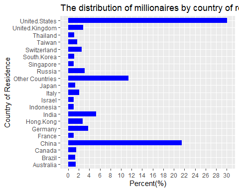{width="5.0526312335958in"
height="4.0421052055993in"}

### USA'de ikamet eden milyonerlerin bolgelere gore dagilimi (residenceStateRegion, unique = 5)

    df_residenceStateRegion <- as.data.frame(my.table(df$residenceStateRegion))
    df_residenceStateRegion$Region <- rownames(df_residenceStateRegion)
    df_residenceStateRegion <- df_residenceStateRegion[df_residenceStateRegion$Region != "NA.", , drop = FALSE]
    df_residenceStateRegion
    ##                    n percent           Region
    ## Midwest           24     2.4          Midwest
    ## Northeast         80     8.0        Northeast
    ## South             92     9.2            South
    ## U.S..Territories   1     0.1 U.S..Territories
    ## West             101    10.1             West
    ggplot(df_residenceStateRegion, aes(x = Region, y = percent)) +
      geom_bar(stat = "identity", fill = "blue", width = 0.7) +
      labs(title = "Distribution of Millionaires by Regions of USA", x = "Region", y = "Percent(%)") +
      scale_y_continuous(breaks = seq(0, max(df_industries$percent), by = 1)) 

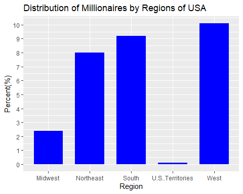{width="5.0526312335958in"
height="4.0421052055993in"}

## 4.2. Demografik analiz: Milyarderlerin yasini (age), cinsiyetini (gender) ve dogum yeri (countryOfCitizenship) demografisini arastirin.

### Milyonerlerin vatandasi oldugu ulkelere gore dagilimi (countryOfCitizenship, unique = 62)

countryOfCitizenship icin frekans tablosu:

    df_countryOfCitizenship <- as.data.frame(my.table(df$countryOfCitizenship))
    df_countryOfCitizenship$Citizenship <- rownames(df_countryOfCitizenship)

Cok fazla ulke var. Dusuk sayida milyoner olan ulkeleri bir araya
toplayarak daha okunur bir grafik elde edilebilir.

**Milyonerlerin %1'inden azini barindiran ulkeler:**

    low_percent_rows <- df_countryOfCitizenship[df_countryOfCitizenship$percent < 1, ]
    low_percent_rows
    ##                      n percent          Citizenship
    ## Algeria              1     0.1              Algeria
    ## Argentina            2     0.2            Argentina
    ## Austria              3     0.3              Austria
    ## Belgium              3     0.3              Belgium
    ## Belize               1     0.1               Belize
    ## Chile                4     0.4                Chile
    ## Colombia             2     0.2             Colombia
    ## Cyprus               3     0.3               Cyprus
    ## Czech Republic       3     0.3       Czech Republic
    ## Denmark              1     0.1              Denmark
    ## Egypt                1     0.1                Egypt
    ## Eswatini (Swaziland) 1     0.1 Eswatini (Swaziland)
    ## Finland              1     0.1              Finland
    ## Georgia              1     0.1              Georgia
    ## Greece               3     0.3               Greece
    ## Hungary              2     0.2              Hungary
    ## Ireland              3     0.3              Ireland
    ## Israel               9     0.9               Israel
    ## Kazakhstan           4     0.4           Kazakhstan
    ## Lebanon              3     0.3              Lebanon
    ## Mexico               6     0.6               Mexico
    ## Monaco               1     0.1               Monaco
    ## Morocco              1     0.1              Morocco
    ## Nepal                1     0.1                Nepal
    ## Netherlands          3     0.3          Netherlands
    ## Nigeria              1     0.1              Nigeria
    ## Norway               4     0.4               Norway
    ## Oman                 1     0.1                 Oman
    ## Panama               1     0.1               Panama
    ## Peru                 3     0.3                 Peru
    ## Philippines          4     0.4          Philippines
    ## Poland               2     0.2               Poland
    ## Qatar                1     0.1                Qatar
    ## Romania              4     0.4              Romania
    ## Singapore            7     0.7            Singapore
    ## South Africa         2     0.2         South Africa
    ## Spain                7     0.7                Spain
    ## Turkey               6     0.6               Turkey
    ## Ukraine              2     0.2              Ukraine
    ## United Arab Emirates 4     0.4 United Arab Emirates
    ## Vietnam              5     0.5              Vietnam
    ## Zimbabwe             1     0.1             Zimbabwe

**Milyonerlerin %1'inden fazlasini barindiran ulkeler:**

    high_percent_rows <- df_countryOfCitizenship[!(df_countryOfCitizenship$percent < 1), ]
    high_percent_rows
    ##                  n percent    Citizenship
    ## Australia       17     1.7      Australia
    ## Brazil          20     2.0         Brazil
    ## Canada          22     2.2         Canada
    ## China          209    20.9          China
    ## France          14     1.4         France
    ## Germany         43     4.3        Germany
    ## Hong Kong       22     2.2      Hong Kong
    ## India           55     5.5          India
    ## Indonesia       10     1.0      Indonesia
    ## Italy           24     2.4          Italy
    ## Japan           13     1.3          Japan
    ## Malaysia        10     1.0       Malaysia
    ## Russia          41     4.1         Russia
    ## South Korea     12     1.2    South Korea
    ## Sweden          13     1.3         Sweden
    ## Switzerland     11     1.1    Switzerland
    ## Taiwan          22     2.2         Taiwan
    ## Thailand        11     1.1       Thailand
    ## United Kingdom  23     2.3 United Kingdom
    ## United States  290    29.0  United States

**Milyonerlerin %1'inden azini barindiran ulkeleri iceren satirin
olusturulmasi:**

    total_low_percent <- data.frame(
      n = sum(low_percent_rows$n),
      percent = sum(low_percent_rows$percent),
      Citizenship = "Other"
    )

**Milyonerlerin %1'inden fazlasini barindiran ulkeler ile yeni satirin
birlestirilmesi:**

    df_countryOfCitizenship2 <- rbind(high_percent_rows, total_low_percent)
    df_countryOfCitizenship2
    ##                  n percent    Citizenship
    ## Australia       17     1.7      Australia
    ## Brazil          20     2.0         Brazil
    ## Canada          22     2.2         Canada
    ## China          209    20.9          China
    ## France          14     1.4         France
    ## Germany         43     4.3        Germany
    ## Hong Kong       22     2.2      Hong Kong
    ## India           55     5.5          India
    ## Indonesia       10     1.0      Indonesia
    ## Italy           24     2.4          Italy
    ## Japan           13     1.3          Japan
    ## Malaysia        10     1.0       Malaysia
    ## Russia          41     4.1         Russia
    ## South Korea     12     1.2    South Korea
    ## Sweden          13     1.3         Sweden
    ## Switzerland     11     1.1    Switzerland
    ## Taiwan          22     2.2         Taiwan
    ## Thailand        11     1.1       Thailand
    ## United Kingdom  23     2.3 United Kingdom
    ## United States  290    29.0  United States
    ## 1              118    11.8          Other

bar plot

    ggplot(df_countryOfCitizenship2, aes(x = Citizenship, y = percent)) +
      geom_bar(stat = "identity", fill = "blue", width = 0.7) +
      coord_flip() +
      labs(title = "Distribution of Millionaires by The Country of Citizenship", x = "Country of Citizenship", y = "Percent(%)") +
      scale_y_continuous(breaks = seq(0, max(df_countryOfCitizenship$percent), by = 2)) 

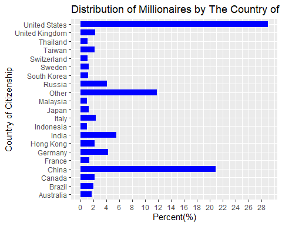{width="5.0526312335958in"
height="4.0421052055993in"}

### Milyonerlerin yaslarinin dagilimi:

    summary(df$age)
    ##    Min. 1st Qu.  Median    Mean 3rd Qu.    Max.    NA's 
    ##   21.00   56.00   65.00   64.78   74.00  101.00      23
    hist(df$age, col = "blue", main = "Histogram Graph of Millionaires' Ages", xlab = "Age")

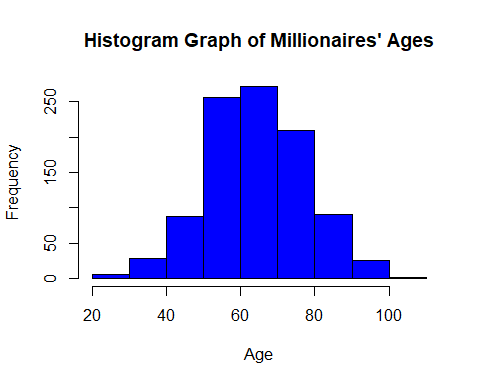{width="5.0526312335958in"
height="4.0421052055993in"}

Degiskenin dagilimi normal dagilim.

### Milyonerlerin cinsiyetlerinin dagilimi:

    df_gender <- as.data.frame(my.table(df$gender))
    df_gender$gender <- c("Female", "Male")
    df_gender
    ##     n percent gender
    ## F 120      12 Female
    ## M 880      88   Male

Odev verisindeki milyonerlerin %88'i erkek, %12' si kadindir.

    ggplot(df_gender, aes(x = gender, y = percent)) +
      geom_bar(stat = "identity", fill = "blue", width = 0.7)+
      labs(title = "Distribution of Millionaires by Gender", x = "Gender", y = "Percent(%)")+
      scale_y_continuous(breaks = seq(0, max(df_gender$percent), by = 10)) 

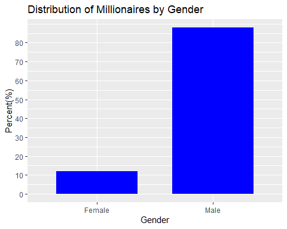{width="5.0526312335958in"
height="4.0421052055993in"}

### Milyonerlerin cinsiyetlerine gore yaslarinin karsilastirilmasi

    tapply(df$age, df$gender, summary)
    ## $F
    ##    Min. 1st Qu.  Median    Mean 3rd Qu.    Max.    NA's 
    ##   35.00   55.00   66.00   65.48   76.00   98.00      11 
    ## 
    ## $M
    ##    Min. 1st Qu.  Median    Mean 3rd Qu.    Max.    NA's 
    ##   21.00   56.00   65.00   64.69   74.00  101.00      12

Kadin milyonerlerin yas ortalamasi 65.5, erkeklerinse 64.7' dur. Her iki
grubun da yas(age) verisinde eksik gozlemler vardir.

Cinsiyetlere gore yas dagilimi histogram grafigi

    par(mfrow=c(1,2))
    hist(df$age[df$gender == "F"], xlab = "Age distribution of female millionaires", main = NULL, col = "blue")
    hist(df$age[df$gender == "M"], xlab = "Age distribution of male millionaires", main = NULL, ylab = NULL, col = "blue")

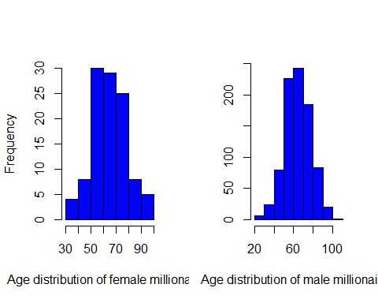{width="5.0526312335958in"
height="4.0421052055993in"}

    par(mfrow=c(1,1))

Age degiskeni her iki grupta da normal dagilima sahip.

Cinsiyetlere gore yas dagilimi boxplot

    ggplot(df, aes(x = gender, y = age)) +
      geom_boxplot(fill = "blue") +
      labs(title = "Box plot of age distribution by gender",
           x = "Gender",
           y = "Age")

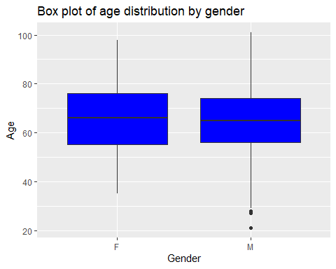{width="5.0526312335958in"
height="4.0421052055993in"}

### Kadin milyonerler ile erkek milyonerlerin yas ortalamalari arasinda fark var mi?

H0: Kadinlar ile erkeklerin yas ortalamalari arasinda fark yoktur.

H1: Kadinlar ile erkeklerin yas ortalamalari arasinda fark vardir.

Student's t test ile analiz edilir:

    t.test(df$age[df$gender == "F"], df$age[df$gender == "M"], alternative = c("two.sided"))
    ## 
    ##  Welch Two Sample t-test
    ## 
    ## data:  df$age[df$gender == "F"] and df$age[df$gender == "M"]
    ## t = 0.56422, df = 133.52, p-value = 0.5736
    ## alternative hypothesis: true difference in means is not equal to 0
    ## 95 percent confidence interval:
    ##  -1.971797  3.545741
    ## sample estimates:
    ## mean of x mean of y 
    ##  65.47706  64.69009

Test sonucunda H0 ret edilemez (t = 0.56, p = 0.57). Kadinlar ile
erkeklerin yas ortalamalari arasinda fark yoktur.

## 4.3. Kendi kendine yapilan ve miras alinan zenginlik: Kendi kendine milyarder olanlarin ve onlarin servetini miras alan kisilerin oranini analiz edin.

**status**: "D" kendi cabasiyla kazanilmis serveti temsil eder
(Kurucular/Girisimciler), "U" ise miras veya kazanilmamis serveti
gosterir.

status icin frekans tablosu:

    df_status <- as.data.frame(my.table(df$status))
    df_status
    ##                        n percent
    ## D                    452    45.2
    ## E                    102    10.2
    ## N                     62     6.2
    ## R                     20     2.0
    ## Split Family Fortune  27     2.7
    ## U                    337    33.7

Odevin verisindeki milyonerlerin %45.2' si self made milyoner, %33.7' si
ise miras veya kazanilmamis servet sonucu milyonerdir.

### Oranlar arasinda fark var mi?

Iki oranin karsilastirilmasi: Binom test, prop.test()

H0: Iki oran arasinda fark yoktur.

H1: Iki oran arasinda fark vardir.

    prop.test(c(df_status[1,1], df_status[6,1]), c(sum(df_status$n), sum(df_status$n)), alternative = "two.sided")
    ## 
    ##  2-sample test for equality of proportions with continuity correction
    ## 
    ## data:  c(df_status[1, 1], df_status[6, 1]) out of c(sum(df_status$n), sum(df_status$n))
    ## X-squared = 27.203, df = 1, p-value = 1.832e-07
    ## alternative hypothesis: two.sided
    ## 95 percent confidence interval:
    ##  0.07145808 0.15854192
    ## sample estimates:
    ## prop 1 prop 2 
    ##  0.452  0.337

H0 ret edilir (ki-kare test(sd = 1) = 27.203, p \< 0.01), iki oran
arasinda istatistiksel olarak anlamli fark vardir.

## 4.4. Ekonomik gostergeler: Milyarder serveti ile GSYIH, TUFE ve vergi oranlari gibi ekonomik gostergeler arasindaki korelasyonlarıi inceleyin.

cpi_country --\> Milyarderin ulkesinin Tuketici Fiyat Endeksi (TUFE)

cpi_change_country --\> Milyarderin ulkesindeki TUFE degisimi

gdp_country --\> Milyarderin ulkesinin Gayri Safi Yurtici Hasilasi
(GSYIH)

    for (j in colnames(df[25:27])){
      cat(match(j, colnames(df)), j, "-->", class(df[ ,j]), 
          "(","missing =", sum(is.na(df[j])),
          "/", "unique =", length(unique(df[, j])), ")", "\n")
    }
    ## 25 cpi_country --> numeric ( missing = 71 / unique = 55 ) 
    ## 26 cpi_change_country --> numeric ( missing = 71 / unique = 43 ) 
    ## 27 gdp_country --> character ( missing = 0 / unique = 56 )

gdp_country degiskeni character tipinde. Oncelikle bu degisken
incelenmeli:

    df[1:10, "gdp_country"]
    ##  [1] "$21,427,700,000,000 " "$529,606,710,418 "    "$1,394,116,310,769 " 
    ##  [4] ""                     "$21,427,700,000,000 " "$19,910,000,000,000 "
    ##  [7] "$1,699,876,578,871 "  "$21,427,700,000,000 " "$754,411,708,203 "   
    ## [10] ""

Eksik gozlemler uygun girilmemis. Eksik gozlemlere NA atanmasi:

    df$gdp_country <- ifelse(df$gdp_country == "", NA, df$gdp_country)

    sum(is.na(df$gdp_country))
    ## [1] 64

gdp_country icindeki virgul ve dolar isaretlerini kaldirma

gsub() fonksiyonu, bir karakter dizisi icinde belirli ifadeleri bulup
degistirmek icin kullanilir. (R CookBook 7.5)

gsub(old, new, string) --\> (old: Degistirilmek istenen desen, new:
yerine konacak yeni deger, string: Deseni iceren karakter dizisi veya
vektor)

    df$gdp_country <- gsub("[\\$,]", "", df$gdp_country)
    df[1:20, "gdp_country"]
    ##  [1] "21427700000000 " "529606710418 "   "1394116310769 "  NA               
    ##  [5] "21427700000000 " "19910000000000 " "1699876578871 "  "21427700000000 "
    ##  [9] "754411708203 "   NA                "21427700000000 " "21427700000000 "
    ## [13] "21427700000000 " "5081769542380 "  "19910000000000 " "2827113184696 " 
    ## [17] NA                "703082435360 "   "421142267938 "   "21427700000000 "

gdp_country'yi numeric formata cevirme:

    df$gdp_country <- as.numeric(df$gdp_country)

### Degiskenlerin dagilimlarinin incelenmesi {#degiskenlerin-dagilimlarinin-incelenmesi-1}

    apply(df[25:27], 2, summary)
    ##         cpi_country cpi_change_country  gdp_country
    ## Min.        99.5500          -1.900000 7.184844e+09
    ## 1st Qu.    117.2400           1.800000 1.839758e+12
    ## Median     117.2400           2.900000 1.991000e+13
    ## Mean       127.5836           4.447578 1.224980e+13
    ## 3rd Qu.    125.0800           7.500000 2.142770e+13
    ## Max.       288.5700          53.500000 2.142770e+13
    ## NA's        71.0000          71.000000 6.400000e+01

cpi_country histogram ve kutu grafigi:

Birden fazla grafige ortak ana baslik eklemek icin mtext() fonkisyonu
kullanildi
(<https://statisticsglobe.com/common-main-title-for-multiple-plots-in-r>).

    par(mfrow=c(1,2))
    hist(df$cpi_country, col = "blue", main = NULL, xlab = NULL)
    boxplot(df$cpi_country, col = "blue", main = NULL, xlab = NULL)
    mtext("Consumer Price Index (CFI) Distribution for Billionaire's Country", line = 1, adj = 1.5)

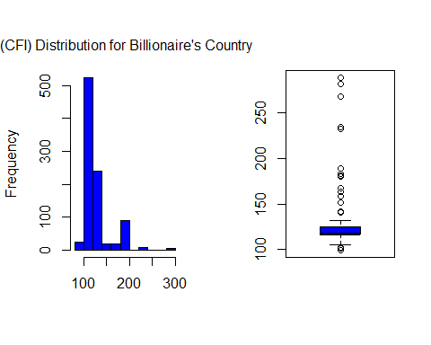{width="5.0526312335958in"
height="4.0421052055993in"}

    par(mfrow=c(1,1))

Dagilim normal degil, cok sayida aykiri gozlem var.

cpi_change_country histogram ve kutu grafigi:

    par(mfrow=c(1,2))
    hist(df$cpi_change_country, col = "blue", main = NULL, xlab = NULL)
    boxplot(df$cpi_change_country, col = "blue", main = NULL, xlab = NULL)
    mtext("CPI Change for Billionaire's Country", line = 1, adj = 12)

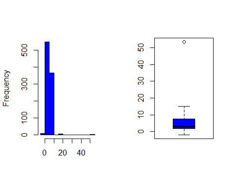{width="5.0526312335958in"
height="4.0421052055993in"}

    par(mfrow=c(1,1))

Dagilim normal degil, 1 tane aykiri gozlem var.

gdp_country histogram ve kutu grafigi:

    par(mfrow=c(1,2))
    hist(df$gdp_country, col = "blue", main = NULL, xlab = NULL)
    boxplot(df$gdp_country, col = "blue", main = NULL, xlab = NULL)
    mtext("Gross Domestic Product (GDP) for Billionaire's Country", line = 1, adj = 2)

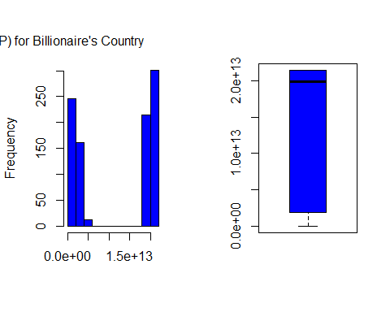{width="5.0526312335958in"
height="4.0421052055993in"}

    par(mfrow=c(1,1))

Dagilim normal degil, aykiri deger yok.

### Degiskenler arasi korelasyonlar

Degiskenler normal dagilim gostermediginden, Spearman korelasyon analizi
ile incelendi.

H0: Degiskenler arasinda korelasyon yoktur.

H1: Degiskenler arasinda korelasyon vardir.

cpi_country ile cpi_change_country arasindaki korelasyon:

    cor.test(df$cpi_country, df$cpi_change_country, method = "spearman")
    ## Warning in cor.test.default(df$cpi_country, df$cpi_change_country, method =
    ## "spearman"): Cannot compute exact p-value with ties
    ## 
    ##  Spearman's rank correlation rho
    ## 
    ## data:  df$cpi_country and df$cpi_change_country
    ## S = 80030934, p-value < 2.2e-16
    ## alternative hypothesis: true rho is not equal to 0
    ## sample estimates:
    ##       rho 
    ## 0.4010887

H0 ret edilir (S = 80030934, p \< 0.01), iki degisken arasindaki
korelasyon istatistiksel olarak anlamlidir. Iki degisken arasinda
pozitif yonde zayif iliski vardir (r = 0.40).

    plot(df$cpi_country, df$cpi_change_country, xlab = "CPI for Billionaire's Country", ylab = "CPI Change for Billionaire's Country")

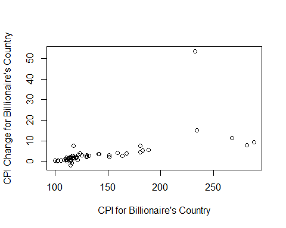{width="5.0526312335958in"
height="4.0421052055993in"}

cpi_country ile gdp_country arasindaki korelasyon:

    cor.test(df$cpi_country, df$gdp_country, method = "spearman")
    ## Warning in cor.test.default(df$cpi_country, df$gdp_country, method =
    ## "spearman"): Cannot compute exact p-value with ties
    ## 
    ##  Spearman's rank correlation rho
    ## 
    ## data:  df$cpi_country and df$gdp_country
    ## S = 147605010, p-value = 0.00141
    ## alternative hypothesis: true rho is not equal to 0
    ## sample estimates:
    ##        rho 
    ## -0.1046017

H0 ret edilir (S = 147605010, p \< 0.01), iki degisken arasindaki
korelasyon istatistiksel olarak anlamlidir. Iki degisken arasinda
negatif yonde cok zayif iliski vardir (r = -0.10).

    plot(df$cpi_country, df$gdp_country, xlab = "CPI for Billionaire's Country", ylab = "GDP for Billionaire's Country")

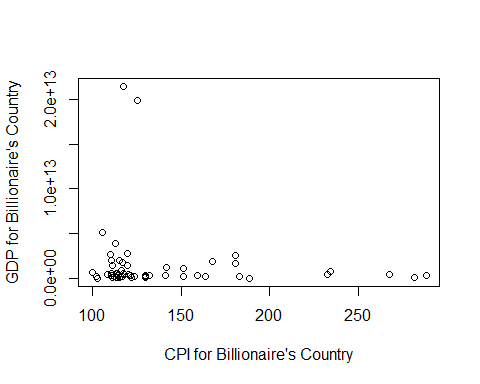{width="5.0526312335958in"
height="4.0421052055993in"}

cpi_change_country ile gdp_country arasindaki korelasyon:

    cor.test(df$cpi_change_country, df$gdp_country, method = "spearman")
    ## Warning in cor.test.default(df$cpi_change_country, df$gdp_country, method =
    ## "spearman"): Cannot compute exact p-value with ties
    ## 
    ##  Spearman's rank correlation rho
    ## 
    ## data:  df$cpi_change_country and df$gdp_country
    ## S = 53382027, p-value < 2.2e-16
    ## alternative hypothesis: true rho is not equal to 0
    ## sample estimates:
    ##       rho 
    ## 0.6005157

H0 ret edilir (S = 53382027, p \< 0.01), iki degisken arasindaki
korelasyon istatistiksel olarak anlamlidir. Iki degisken arasinda
pozitif yonde orta gucte iliski vardir (r = 0.60).

    plot(df$cpi_change_country, df$gdp_country, xlab = "CPI Change for Billionaire's Country", ylab = "GDP for Billionaire's Country")

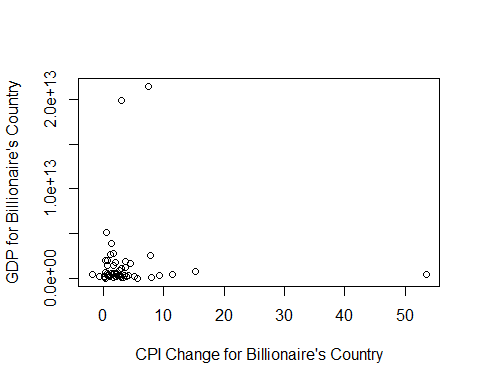{width="5.0526312335958in"
height="4.0421052055993in"}

## 4.5. Mekansal analiz: Milyarderlerin cografi dagilimini(country) ve servetlerini (finalWorth) bir harita uzerinde gorsellestirin.

finalWorth degiskeninin dagilimi:

    summary(df$finalWorth)
    ##    Min. 1st Qu.  Median    Mean 3rd Qu.    Max. 
    ##    1000    1500    2400    4716    4100  180000
    ggplot(df) +
      geom_histogram(aes(x = finalWorth), bins = 10, fill = "blue") +
      scale_x_continuous(breaks = seq(0, max(df$finalWorth), by = 20000)) +
      labs(title = "Histogram of Final Net Worth of Billionaires in U.S. Dollars", x = "Final Net Worth")

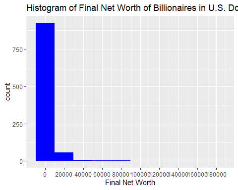{width="5.0526312335958in"
height="4.0421052055993in"}

Veride bulunan az sayidaki multimilyarder, finalWorth degiskeninin
dagiliminin carpik olmasina neden olmaktadir.

### Ikamet edilen ulkeye gore final net deger dagilimi

Cok fazla ulke var (unique = 62). Oncelikle dusuk sayida milyoner olan
ulkeler bir araya toplanacaktir.

Milyonerlerin %1'inden fazlasini barindiran ulkeler:

    high_percent_rows
    ##                  n percent    Citizenship
    ## Australia       17     1.7      Australia
    ## Brazil          20     2.0         Brazil
    ## Canada          22     2.2         Canada
    ## China          209    20.9          China
    ## France          14     1.4         France
    ## Germany         43     4.3        Germany
    ## Hong Kong       22     2.2      Hong Kong
    ## India           55     5.5          India
    ## Indonesia       10     1.0      Indonesia
    ## Italy           24     2.4          Italy
    ## Japan           13     1.3          Japan
    ## Malaysia        10     1.0       Malaysia
    ## Russia          41     4.1         Russia
    ## South Korea     12     1.2    South Korea
    ## Sweden          13     1.3         Sweden
    ## Switzerland     11     1.1    Switzerland
    ## Taiwan          22     2.2         Taiwan
    ## Thailand        11     1.1       Thailand
    ## United Kingdom  23     2.3 United Kingdom
    ## United States  290    29.0  United States

Milyonerlerin %1'inden fazlasini barindiran ulkelerin listesi:

    df_worth <- df[, c(2,6)]
    high_name <- rownames(high_percent_rows2)
    high_name <- gsub("[\\.]", " ", high_name)
    high_name
    ##  [1] "Australia"      "Brazil"         "Canada"         "China"         
    ##  [5] "France"         "Germany"        "Hong Kong"      "India"         
    ##  [9] "Indonesia"      "Israel"         "Italy"          "Japan"         
    ## [13] "Russia"         "Singapore"      "South Korea"    "Switzerland"   
    ## [17] "Taiwan"         "Thailand"       "United Kingdom" "United States"

Milyonerlerin %1'inden fazlasini barindiran ulkelerin disinda kalanlarin
"Other Countries" olarak atanmasi:

    df_worth$new_country <- df_worth$country
    df_worth[1:5,]
    ##      finalWorth       country   new_country
    ## 2609       1000 United States United States
    ## 2369       1200       Belgium       Belgium
    ## 1177       2600         Spain         Spain
    ## 1098       2800        Taiwan        Taiwan
    ## 1252       2500 United States United States
    # high_name'deki ulkelerin disinda kalanlar 
    for (j in seq_along(df_worth$new_country)) {
      if (!(df_worth$new_country[j] %in% high_name)) {
        df_worth$new_country[j] <- "Other Countries"
      }
    }
    length(unique(df_worth$country))
    ## [1] 63
    length(unique(df_worth$new_country))
    ## [1] 21
    ggplot(df_worth, aes(x = factor(new_country), y = finalWorth)) +
      geom_boxplot(fill = "blue") + 
      coord_flip() +
      labs(title = "The Distribution of Final Net Worth by Country of Residence", x = "Country of Residence", y = "Final Net Worth") +
      scale_y_continuous(breaks = seq(0, max(df_worth$finalWorth), by = 20000)) 

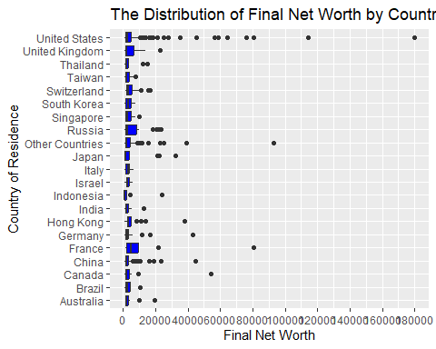{width="5.0526312335958in"
height="4.0421052055993in"}

finalWorth eksenini daha kisa cizerek, boxplot'lari gorunur hale
getirebiliriz.

Bunun icin scale_y\_continuous() fonsiyonunda limits argumani
kullanilir:

    ggplot(df_worth, aes(x = factor(new_country), y = finalWorth)) +
      geom_boxplot(fill = "blue") + 
      coord_flip() +
      labs(title = "The Distribution of Final Net Worth by Country of Residence", x = "Country of Residence", y = "Final Net Worth") +
      scale_y_continuous(breaks = seq(1000, 10000, by = 1000), limits = c(1000, 10000))

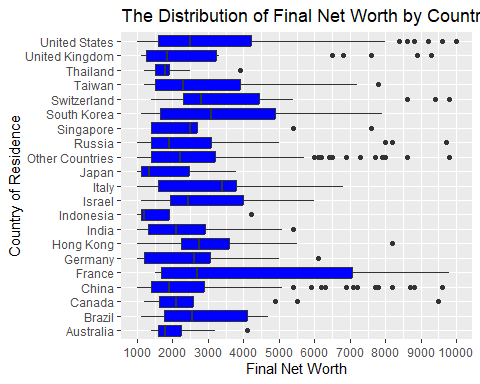{width="5.0526312335958in"
height="4.0421052055993in"}

Fransa ortalamanin ustunde net degeri olan milyonerler yasamaktadir.
Ilgili boxplot diger ulkelere gore oldukca genis.

Fransa' yi South Korea, US, Taiwan, Brazil, Israel ve Italy
izlemektedir. Bu ulkelerde ikamet eden milyonerlerin net degerleri,
diger ulkelere gore daha yuksektir.

## 4.6. Zaman icindeki egilimler: Milyarder demografisindeki ve zenginlikteki yillar icindeki degisiklikleri izleyin.

Veride farkli zamanlarda tekrarli olculmus bir degisken yok (yillar
icindeki degisiklikleri izleyin), zaman olarak kullanilmaya uygun
degiskeni bulamadim. Bu nedenle milyonerlerin yaslari ile net degerleri
arasindaki iliskiyi inceledim.

Yas ile net deger degiskenlerinin sacilim grafigi:

    ggplot(df, aes(x = age, y = finalWorth)) + 
      geom_point(color = "blue", size=2)+
      geom_smooth(method = "lm", formula = y ~ x, se = FALSE, color = "red") +  # regresyon dogrusunu ekler
      labs(title ="The Relationship Between Age and Networth", x = "Age", y = "Final Net Worth")

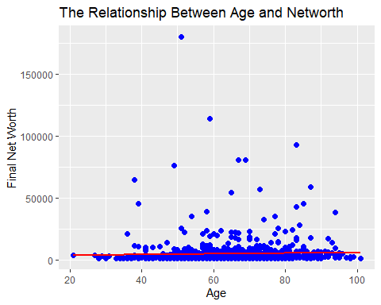{width="5.0526312335958in"
height="4.0421052055993in"}

Grafikte iki degisken arasindaki korelasyonun zayif oldugu
gorulebiliyor. Yasin artmasi ile birlikte net degerde de artis
gorulmuyor.

    cor.test(df$age, df$finalWorth, method = "spearman")
    ## Warning in cor.test.default(df$age, df$finalWorth, method = "spearman"): Cannot
    ## compute exact p-value with ties
    ## 
    ##  Spearman's rank correlation rho
    ## 
    ## data:  df$age and df$finalWorth
    ## S = 130622920, p-value = 5.322e-07
    ## alternative hypothesis: true rho is not equal to 0
    ## sample estimates:
    ##       rho 
    ## 0.1595974

Korelasyon testinin sonuclari da degiskenler arasinda istatistiksel
olarak anlamli ancak zayif korelasyon oldugunu gosteriyor (r = 0.16, p
\< 0.01).

Net degeri 10000 dolarin altinda olanlarin sacilim grafigi:

    ggplot(df, aes(x = age, y = finalWorth)) + 
      geom_point(color = "blue", size=2)+
      geom_smooth(method = "lm", formula = y ~ x, se = FALSE, color = "red") +
      labs(title ="The Relationship Between Age and Networth", x = "Country of Residence", y = "Final Net Worth") +
      scale_y_continuous(breaks = seq(1000, 10000, by = 1000), limits = c(1000, 10000))

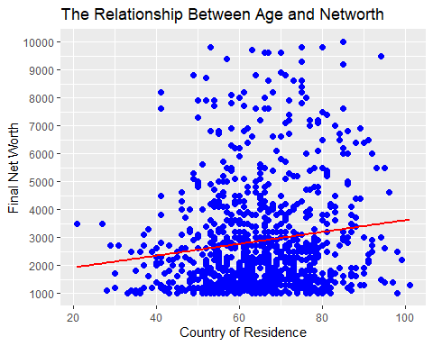{width="5.0526312335958in"
height="4.0421052055993in"}

Net degeri yuksek milyonerlerin cikarilmasiyla degiskenler arasi
korelasyon yukselmistir. Yas arttikca net degerde de artis goruluyor.
Aralarinda dusuk/orta siddette korelasyon var.
